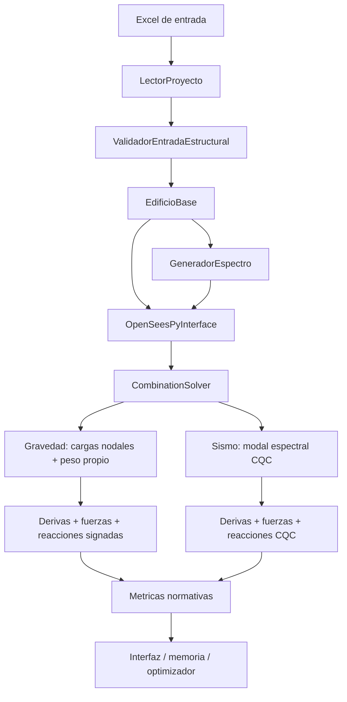
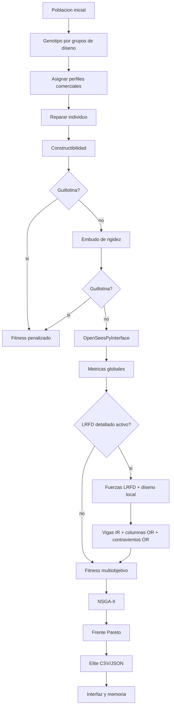
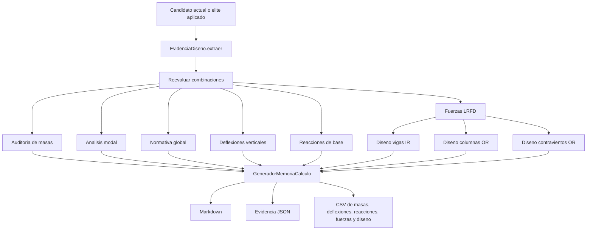
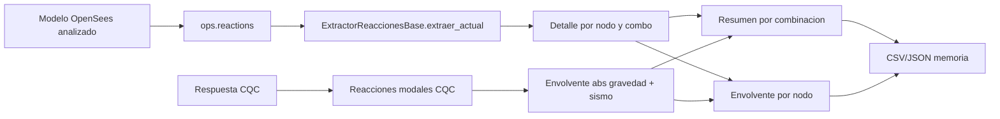
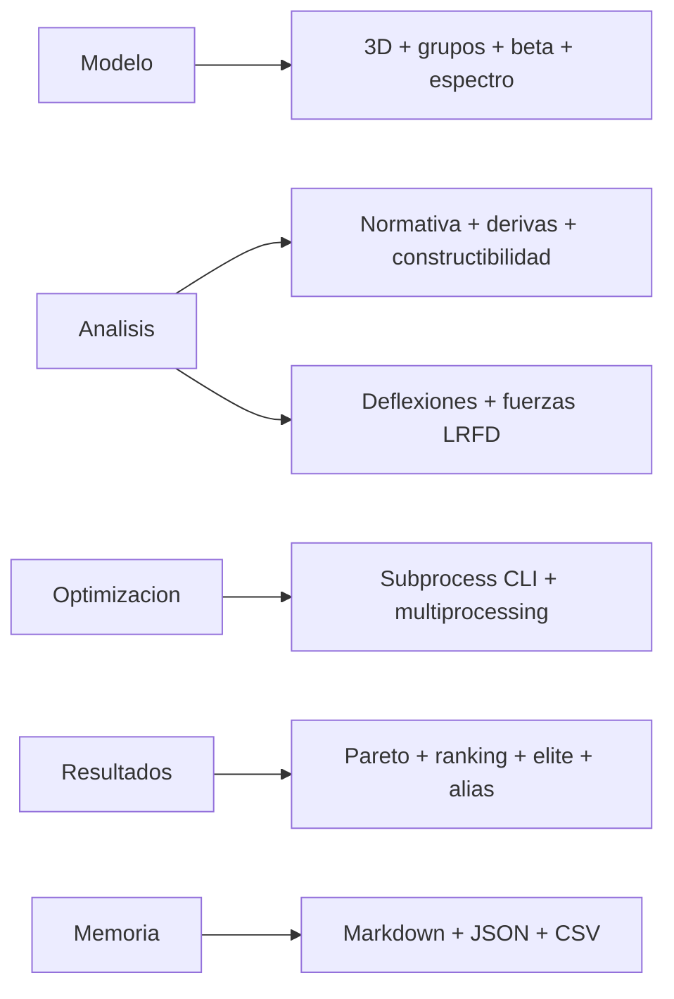

# UML de Arquitectura Actual

**Version:** 4.2  
**Fecha:** Junio 2026  
**Alcance:** flujo real del framework con Streamlit, OpenSeesPy, NSGA-II, LRFD detallado, reacciones de base y memorias trazables.

---

## 1. Diagrama General por Clases

```mermaid
classDiagram

class AppStreamlit {
    +cargar_contexto()
    +fig_modelo_3d()
    +fig_espectro()
    +ejecutar_analisis_actual()
    +ejecutar_auditoria_deflexiones()
    +calcular_fuerzas_lrfd()
    +comando_optimizacion()
    +aplicar_candidato_desde_fila()
    +guardar_alias_corrida()
}

class ContextoProyecto {
    +construir_contexto()
    +aplicar_perfiles_por_grupo()
}

class LectorProyecto {
    +configuracion: dict
    +combinaciones: dict
    +nodos_df
    +elementos_df
    +cargar_todo()
    +leer_configuracion()
    +leer_combinaciones()
}

class ValidadorEntradaEstructural {
    +desde_lector()
    +validar()
    +assert_ok()
}

class EdificioBase {
    +nodos: list
    +elementos: list
    +grupos: dict
    +grupos_diseno: dict
    +construir_desde_dataframes()
    +obtener_alturas_unicas()
    +obtener_nodos_por_nivel()
    +recalcular_masas_propias()
}

class Nodo {
    +id: int
    +x: float
    +y: float
    +z: float
    +empotrado: bool
    +cargas: dict
    +area_trib_m2: float
    +masa_propia_elementos_kg: float
    +obtener_masa_sismica()
    +obtener_peso_sismico()
}

class ElementoMarco {
    +id: int
    +nodo_i: Nodo
    +nodo_j: Nodo
    +seccion: SeccionBase
    +tipo: str
    +grupo_diseno: str
    +orientacion_beta: float
    +calcular_longitud()
    +actualizar_seccion()
    +obtener_ejes_locales()
    +es_columna()
    +es_viga()
    +es_contraviento()
}

class SeccionBase {
    <<abstract>>
    +designacion: str
    +area_m2: float
    +peso_kg_m: float
    +E: float
    +Fy: float
}

class SeccionIR {
    +ix_m4
    +iy_m4
    +bf
    +d
    +tw
    +tf
    +calcular_phi_Mn()
    +revisar_interaccion()
}

class SeccionOR {
    +b
    +t
    +calcular_phi_Pn()
    +revisar_interaccion()
}

class SeccionMixta {
    +area_transformada
    +inercia_transformada
    +calcular_phi_Pn()
    +revisar_interaccion()
}

class MaterialAcero {
    +nombre
    +clave_fy
    +Fy_kg_cm2
    +E
    +Fy
    +densidad_kg_m3
    +nu
}

class MaterialResolver {
    +construir_materiales_acero()
}

class FactorySecciones {
    +factory_seccion_ir()
    +factory_seccion_or()
    +factory_seccion_or_rellena()
}

class GestorIMCA {
    +obtener_catalogo_ir_ordenado()
    +obtener_catalogo_or_ordenado()
}

class GeneradorEspectro {
    +obtener_aceleracion_elastica()
    +obtener_aceleracion_diseno()
    +obtener_espectro()
    +obtener_coeficiente_estatico_diseno()
}

class OpenSeesPyInterface {
    +edificio
    +configuracion
    +combinaciones_db
    +espectro
    +evaluar_combinaciones()
    +ejecutar_sismo_espectral()
}

class ModelBuilder {
    +construir()
    +aplicar_peso_propio_elementos()
    +aplicar_cargas_gravedad()
}

class SpectralSolver {
    +calcular_respuesta_cqc()
    +calcular_participacion_modal()
    +seleccionar_modos_por_participacion()
    -_calcular_respuesta_modal_cqc()
}

class CombinationSolver {
    +evaluar_todas()
    -_aplicar_gravedad_combo()
    -_extraer_fuerzas_actuales()
    -_extraer_reacciones_actuales()
}

class ForceExtractor {
    +obtener_vector_fuerzas_elemento()
    +obtener_fuerzas_elemento_detalladas()
}

class ExtractorFuerzasLRFD {
    +generar()
    +exportar_detalle_csv()
    +exportar_envolvente_csv()
    +exportar_envolvente_grupos_csv()
}

class ExtractorReaccionesBase {
    +extraer_actual()
    +desde_resultados()
    +combinar_envolvente_cqc()
}

class AuditorMasas {
    +auditar()
}

class AuditorDeflexionesVerticales {
    +auditar()
    +exportar_csv()
}

class DemandasLocalesVigasGravitacionales {
    +generar()
}

class DisenadorFlexionVigasIR_NTC {
    +evaluar()
    +exportar_csv()
    +exportar_json()
}

class DisenadorColumnasOR_NTC {
    +evaluar()
    +exportar_csv()
    +exportar_json()
}

class DisenadorContravientosOR_NTC {
    +evaluar()
    +exportar_csv()
    +exportar_json()
}

class Genotipo {
    +nombres_grupos
    +crear_individual()
    +decodificar()
    +asignar_perfiles()
    +mutar()
    +reparar()
}

class Constructibilidad {
    +evaluar_detallado()
    -_penal_columnas_mismo_perfil_altura()
    -_penal_telescopico()
    -_penal_nudos()
    -_penal_cfvd()
}

class EmbudoOptimizacion {
    +evaluar_nivel_1_rigidez()
}

class ObjetivoDeriva {
    +detectar_sistema_lateral()
    +resolver_objetivo_deriva()
    +aplicar_objetivo_deriva_config()
}

class Evaluador {
    +evaluar()
    +evaluar_detallado()
    -_extraer_metricas_normativas()
    -_metricas_lrfd_detallado()
    -_generar_fuerzas_lrfd_para_optimizacion()
    -_fitness_desde_metricas()
}

class OptimizadorGenetico {
    +ejecutar_evolucion()
    +exportar_frente_pareto()
    -_seleccionar_elite_candidatos()
    -_cumplimientos_normativos()
    -_limpiar_resultados_antiguos()
}

class EvidenciaDiseno {
    +extraer()
    -_cumplimientos_normativos()
    -_constructibilidad()
    -_revisiones_por_tipo()
}

class GeneradorMemoriaCalculo {
    +generar()
    -_seccion_masas()
    -_seccion_modal()
    -_seccion_normativa()
    -_seccion_deflexiones()
    -_seccion_reacciones_base()
    -_seccion_fuerzas_lrfd()
    -_seccion_diseno_vigas_ir()
    -_seccion_diseno_columnas_or()
    -_seccion_diseno_contravientos_or()
}

AppStreamlit --> ContextoProyecto
AppStreamlit --> OpenSeesPyInterface
AppStreamlit --> OptimizadorGenetico
AppStreamlit --> GeneradorMemoriaCalculo

ContextoProyecto --> LectorProyecto
ContextoProyecto --> ValidadorEntradaEstructural
ContextoProyecto --> MaterialResolver
ContextoProyecto --> GestorIMCA
ContextoProyecto --> EdificioBase
ContextoProyecto --> GeneradorEspectro
ContextoProyecto --> OpenSeesPyInterface

LectorProyecto --> EdificioBase
ValidadorEntradaEstructural --> LectorProyecto

EdificioBase "1" *-- "*" Nodo
EdificioBase "1" *-- "*" ElementoMarco
ElementoMarco o-- SeccionBase
SeccionBase <|-- SeccionIR
SeccionBase <|-- SeccionOR
SeccionBase <|-- SeccionMixta

MaterialResolver --> MaterialAcero
FactorySecciones --> SeccionIR
FactorySecciones --> SeccionOR
FactorySecciones --> SeccionMixta
GestorIMCA --> FactorySecciones

OpenSeesPyInterface --> ModelBuilder
OpenSeesPyInterface --> CombinationSolver
CombinationSolver --> SpectralSolver
CombinationSolver --> ForceExtractor
CombinationSolver --> ExtractorReaccionesBase
SpectralSolver --> ExtractorReaccionesBase

ExtractorFuerzasLRFD --> ForceExtractor
AuditorDeflexionesVerticales --> EdificioBase
DemandasLocalesVigasGravitacionales --> EdificioBase
DisenadorFlexionVigasIR_NTC --> DemandasLocalesVigasGravitacionales
DisenadorFlexionVigasIR_NTC --> ExtractorFuerzasLRFD
DisenadorColumnasOR_NTC --> ExtractorFuerzasLRFD
DisenadorContravientosOR_NTC --> ExtractorFuerzasLRFD

OptimizadorGenetico --> Genotipo
OptimizadorGenetico --> Evaluador
OptimizadorGenetico --> Constructibilidad
OptimizadorGenetico --> EmbudoOptimizacion
OptimizadorGenetico --> ObjetivoDeriva
Evaluador --> OpenSeesPyInterface
Evaluador --> Constructibilidad
Evaluador --> EmbudoOptimizacion
Evaluador --> ObjetivoDeriva
Evaluador --> ExtractorFuerzasLRFD
Evaluador --> DisenadorFlexionVigasIR_NTC
Evaluador --> DisenadorColumnasOR_NTC
Evaluador --> DisenadorContravientosOR_NTC

GeneradorMemoriaCalculo --> EvidenciaDiseno
EvidenciaDiseno --> OpenSeesPyInterface
EvidenciaDiseno --> AuditorMasas
EvidenciaDiseno --> AuditorDeflexionesVerticales
EvidenciaDiseno --> ExtractorFuerzasLRFD
EvidenciaDiseno --> ExtractorReaccionesBase
EvidenciaDiseno --> DisenadorFlexionVigasIR_NTC
EvidenciaDiseno --> DisenadorColumnasOR_NTC
EvidenciaDiseno --> DisenadorContravientosOR_NTC
```

---

## 2. Flujo de Analisis

---

## 3. Flujo de Optimizacion

---

## 4. Flujo de Memoria

---

## 5. Flujo de Reacciones de Base

---

## 6. Flujo de Interfaz

---

## 7. Notas de Arquitectura

- `contexto_proyecto.py` es la fuente unica para crear el edificio.
- `OpenSeesPyInterface` concentra el analisis fisico validado.
- `Evaluador` no implementa fisica paralela; llama al motor validado.
- `ObjetivoDeriva` adapta la meta de deriva al sistema lateral detectado.
- `DemandasLocalesVigasGravitacionales` corrige el diseno local de vigas cuando las cargas llegan como nodales.
- `ExtractorReaccionesBase` exporta reacciones para cimentacion preliminar y usa envolvente absoluta en CQC.
- `OptimizadorGenetico` exporta resultados trazables y amigables.
- La interfaz permite editar alias sin renombrar carpetas tecnicas.
