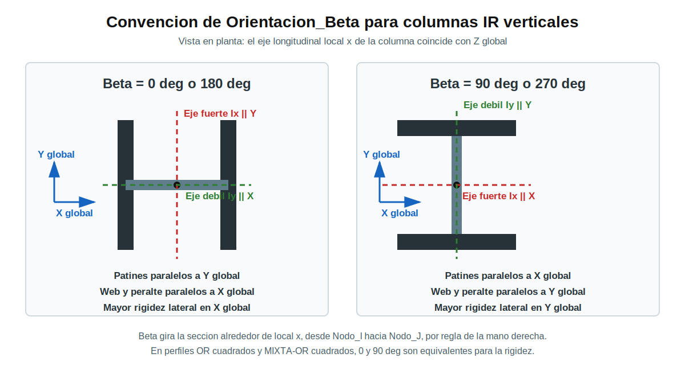

# Convencion de Orientacion_Beta

## Alcance

Este documento define la convencion usada por el framework para orientar
secciones en elementos tridimensionales. La tabla simplificada aplica a
**columnas verticales con perfiles IR**.

La orientacion de perfiles OR cuadrados y MIXTA-OR cuadrados no cambia su
rigidez entre 0 y 90 grados porque sus inercias principales son iguales.



## Definicion

- El eje longitudinal local `x` del elemento va desde `Nodo_I` hacia `Nodo_J`.
- `Orientacion_Beta` gira la seccion alrededor de ese eje local `x`.
- El signo positivo sigue la regla de la mano derecha.
- Para una columna convencional con `Nodo_I` abajo y `Nodo_J` arriba, el eje
  local `x` coincide con `+Z` global.

En OpenSees, `elasticBeamColumn` 3D recibe las inercias alrededor de los ejes
locales `y` y `z`. El framework usa la siguiente correspondencia:

```text
Ix IMCA, eje fuerte -> Iy local de OpenSees
Iy IMCA, eje debil  -> Iz local de OpenSees
```

Por tanto, el eje fuerte de la seccion queda alineado con el eje local `y` y
el eje debil queda alineado con el eje local `z`.

## Columnas IR Verticales

| Orientacion_Beta | Patines y eje fuerte Ix | Web, peralte y eje debil Iy | Mayor rigidez lateral |
|---|---|---|---|
| 0 o 180 grados | Paralelos a Y global | Paralelos a X global | Direccion X global |
| 90 o 270 grados | Paralelos a X global | Paralelos a Y global | Direccion Y global |

La direccion del eje fuerte y la direccion de mayor rigidez lateral son
perpendiculares. Por ejemplo, con beta igual a 0 grados el eje fuerte es
paralelo a Y global, por lo que la columna resiste con mayor rigidez un
desplazamiento lateral en X global.

## Angulos Equivalentes

Para un perfil IR doblemente simetrico:

- `0`, `180` y `360` grados representan la misma orientacion fisica.
- `90` y `270` grados representan la misma orientacion fisica.

Los signos de los ejes locales pueden cambiar, pero la rigidez del perfil no
cambia para esos pares equivalentes.

## Otros Elementos

- **Vigas IR:** la orientacion depende de la direccion `Nodo_I -> Nodo_J`; no
  debe interpretarse con la tabla global simplificada de columnas.
- **OR cuadrados y MIXTA-OR cuadrados:** beta 0 y beta 90 son equivalentes para
  la rigidez.
- **Contravientos:** se modelan como `corotTruss`; su respuesta es axial y beta
  no modifica su rigidez.

## Recomendacion Para Excel

En la hoja `Elementos`, usar preferentemente `0` o `90` grados para columnas
IR, salvo que exista una orientacion diagonal intencional. Mantener la misma
convencion en todos los pisos de una misma linea de columnas.

Las imagenes `docs/convencion_beta_columnas_ir.svg` y
`docs/convencion_beta_columnas_ir.png` pueden insertarse en el Excel como guia
visual. El framework no modifica el archivo maestro.

## Alcance De La Revision De Capacidad

`Orientacion_Beta` ya afecta la rigidez y las fuerzas del analisis OpenSees.
La revision de capacidad conserva ahora las demandas locales separadas `My` y
`Mz` para columnas y contravientos con seccion capaz de flexocompresion
biaxial.

Para perfiles IR, el framework toma del catalogo:

- `zx_cm3` para la capacidad plastica del eje fuerte.
- `zy_cm3` para la capacidad plastica del eje debil.
- `rx_cm` y `ry_cm` para la esbeltez por eje.

La interaccion se reporta con capacidades separadas `phiMny` y `phiMnz`.
Esto evita que un momento respecto al eje debil quede oculto dentro de un
momento resultante equivalente. Para perfiles OR y MIXTA-OR cuadrados se usa la
misma capacidad flexionante en ambos ejes locales por simetria.
